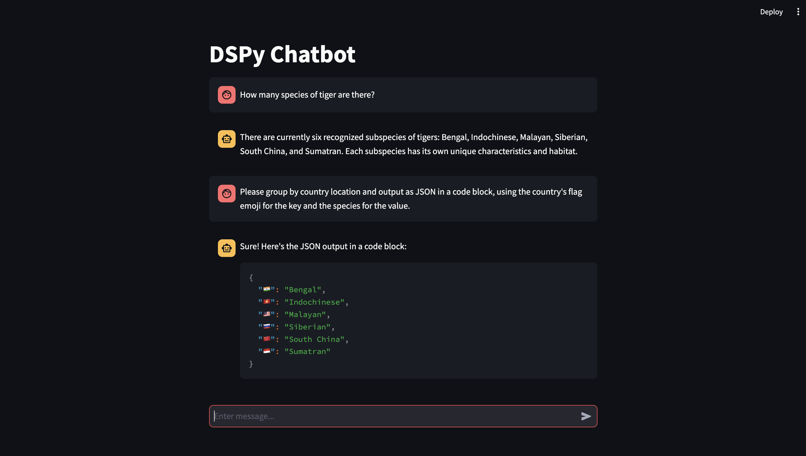

# dspy-chat-app
Basic chat app with memory using DSPy and Streamlit UI.

## Project Structure
```sh
dspy-chat-app/
├── README.md
├── app.py              # Streamlit UI  
├── requirements.txt
├── run.py              # Command line interface
└── src                 # Python modules
```
## Description
Basic Chat UI with persistent memory between interactions.

<p align="center">
  
</p>

## Quickstart
1. Clone the repository.
2. Create a [Python virtual environment](#python-virtual-environment) and install the required packages.
4. [Create a `.env` file](#openai-api-key) with the OpenAI API key.
5. [Run the Streamlit application](#usage) or the command line interface.

## Installation

### Prequisites
* Python 3.12
* OpenAI API Key

### Environment

#### Python Virtual Environment
Create a Python environment using the following commands.
```bash
python3.12 -m venv .venv
source .venv/bin/activate
pip install --upgrade pip
pip install -r requirements.txt
```

#### OpenAI API Key
Create a `.env` file in the root directory and add the following line.
```bash
OPENAI_API_KEY=<YOUR_API_KEY>
```

## Usage
To run the Streamlit application, use the following command.
```bash
streamlit run app.py
```

To run the command line interface, use the following command.
```bash
python3 run.py
```

## References
- [Streamlit](https://streamlit.io/)
- [DSPy](https://dspy-docs.vercel.app/)

## Contact
**Primary Contact:** [@chrisammon3000](https://github.com/chrisammon3000)
